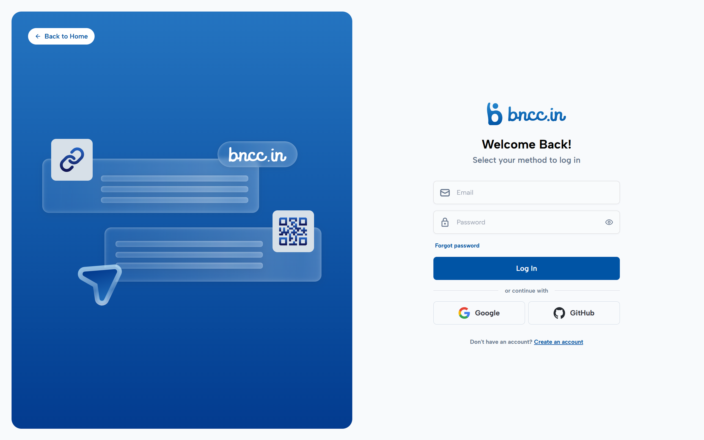
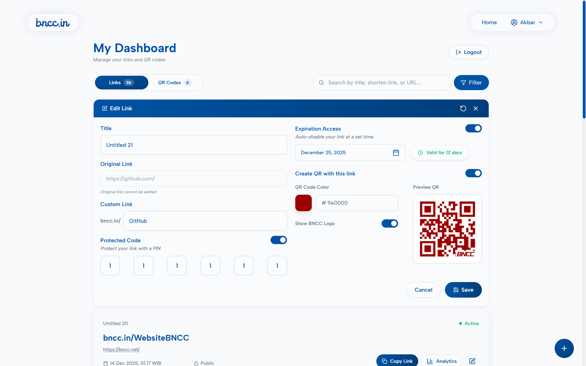
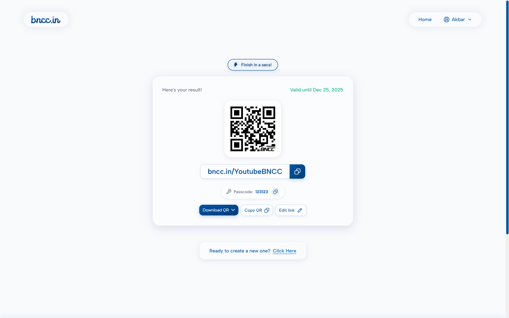
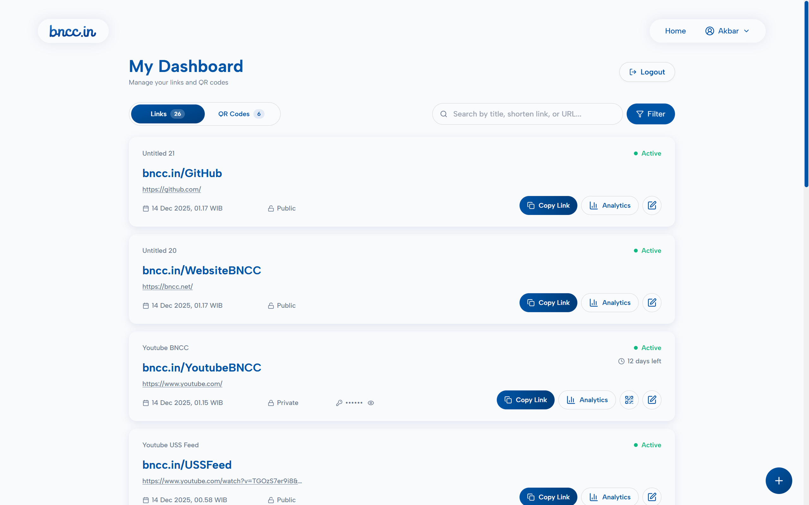
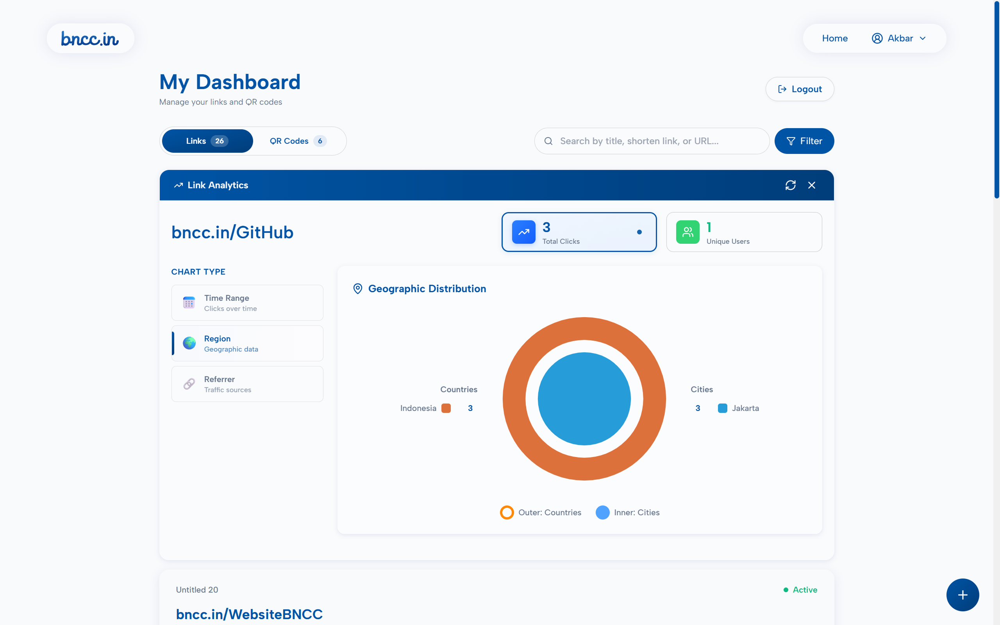

# BNCC.IN — URL Shortener & QR Code Generator

<p align="center">
  <picture>
    <source media="(prefers-color-scheme: dark)" srcset="./frontend/public/logo-bnccin2-white.svg">
    <source media="(prefers-color-scheme: light)" srcset="./frontend/public/logo-bnccin2.svg">
    
  </picture>
</p>

<p align="center">
  <a href="LICENSE.md"></a>
  
  
  
  
</p>

<p align="center">
  A modern URL shortener and QR code generator with analytics dashboard
</p>

---

## Interface Preview

<table>
  <tr>
    <td align="center">
      
      <br />
      <b>🔐 Authentication Page</b>
    </td>
    <td align="center">
      
      <br />
      <b>✂️ Shorten Link / Generate QR</b>
    </td>
  </tr>
  <tr>
    <td align="center">
      
      <br />
      <b>✅ Result Page</b>
    </td>
    <td align="center">
      
      <br />
      <b>📊 Main Dashboard</b>
    </td>
  </tr>
  <tr>
    <td align="center">
      
      <br />
      <b>✏️ Edit Dashboard</b>
    </td>
    <td align="center">
      
      <br />
      <b>📈 Analytics Dashboard</b>
    </td>
  </tr>
</table>

---

## Features

- 🔗 **URL Shortening** - Create short, memorable links with custom aliases
- 🎨 **QR Code Generator** - Generate customizable QR codes with branding options
- 🔐 **Authentication** - Email, Google, and GitHub login support
- 📊 **Analytics Dashboard** - Track clicks, referrers, and geographical data
- 🔒 **Link Protection** - Passcode protection for sensitive links
- ⏰ **Link Expiration** - Set automatic expiration dates
- ✏️ **Link Management** - Edit and organize your links easily

---

## 🛠️ Tech Stack

<table>
  <tr>
    <td align="center" width="33%">
      
      <br /><br />
      Node.js (Express)<br />
      TypeScript<br />
      MongoDB (Mongoose)
    </td>
    <td align="center" width="33%">
      
      <br /><br />
      Next.js 14<br />
      React & TypeScript<br />
      Tailwind CSS
    </td>
    <td align="center" width="33%">
      
      <br /><br />
      Passport.js<br />
      Google OAuth<br />
      GitHub OAuth
    </td>
  </tr>
</table>

---

## Quick Start

### Prerequisites

- Node.js 18 or higher
- npm or yarn
- MongoDB instance (local or Atlas)

### Installation

**1. Clone the repository**
```bash
git clone https://github.com/pisciva/bncc.in.git
cd bncc.in
```

**2. Install backend dependencies**
```bash
cd backend
npm install
```

**3. Install frontend dependencies**
```bash
cd ../frontend
npm install
```

**4. Configure environment variables**

Create `.env` files in both `backend/` and `frontend/` directories with your configuration:

**Backend `.env`:**
```env
# Server URLs
BACKEND_URL=http://localhost:5000
FRONTEND_URL=http://localhost:3000

# Database
MONGO_URI=your_mongodb_connection_string

# Security Secrets
JWT_SECRET=your_jwt_secret_key
SESSION_SECRET=your_session_secret_key

# Google OAuth
GOOGLE_CLIENT_ID=your_google_client_id
GOOGLE_CLIENT_SECRET=your_google_client_secret

# GitHub OAuth
GITHUB_CLIENT_ID=your_github_client_id
GITHUB_CLIENT_SECRET=your_github_client_secret

# Email Service (Resend)
RESEND_API_KEY=your_resend_api_keyy
```

**Frontend `.env`:**
```env
NEXT_PUBLIC_API_URL=http://localhost:5000
NEXT_PUBLIC_SITE_URL=http://localhost:3000
```

**5. Start the servers**

Open two terminal windows:

**Terminal 1 - Backend Server:**
```bash
cd backend
npm run build
npm start
```
> Backend runs on http://localhost:5000

**Terminal 2 - Frontend Server:**
```bash
cd frontend
npm run dev
```
> Frontend runs on http://localhost:3000

🎉 **You're all set!** Visit http://localhost:3000 to see the application.

---

## Project Structure
```
bncc.in/
├── backend/
│   ├── config/              # Database & OAuth configuration
│   ├── middleware/          # Express middleware
│   ├── models/              # MongoDB schemas
│   ├── routes/              # API endpoints
│   ├── utils/               # Helper functions
│   └── index.ts             # Server entry point
│
└── frontend/
    ├── app/                 # Next.js App Router
    ├── components/          # React components
    │   ├── layout/          # Layout components
    │   ├── main/            # Main page components
    │   └── dashboard/       # Dashboard components
    ├── context/             # React Context
    ├── hooks/               # Custom hooks
    ├── lib/                 # API client
    ├── utils/               # Utility functions
    └── public/              # Static assets
```

## License

This project is licensed under the MIT License - see the [LICENSE.md](LICENSE.md) file for details.

---

## Acknowledgments

Built with ❤️ by [BNCC (Bina Nusantara Computer Club)](https://bncc.net)